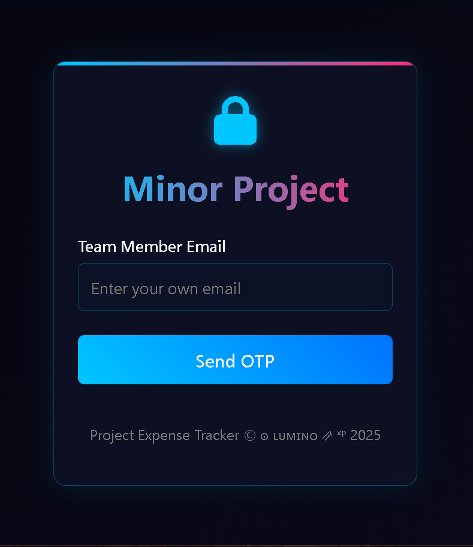
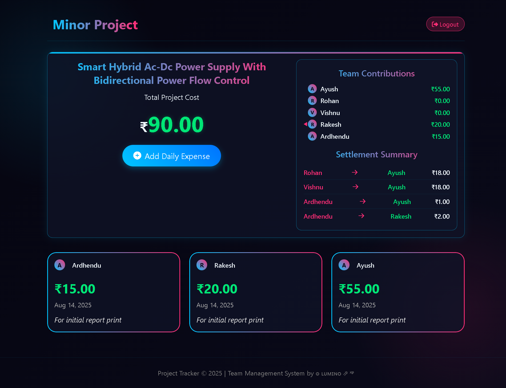

# 💰 Project Cost Tracker

A modern **project expense tracking** web app with **team member login, OTP authentication, and real-time expense updates** powered by **Supabase**.

## 📌 Features

- **Secure Login with OTP** (Email-based verification via Supabase)
- **User Management** – stores team member info with names & avatars
- **Expense Tracking** – add, view, and manage daily expenses
- **Automatic Total Calculation** – real-time cost updates
- **Team Contribution Summary** – see how much each member has contributed
- **Responsive Design** – works on desktop and mobile
- **Modern UI** – gradient themes, cards, and smooth animations

## 🖼️ Screenshots

| Login Page | Dashboard |
|------------|-----------|
|  |  |


## 🛠️ Tech Stack

- **Frontend:** HTML5, CSS3, JavaScript (ES Modules)
- **Backend & Auth:** [Supabase](https://supabase.com/)
- **Icons:** [Font Awesome](https://fontawesome.com/)

## 🚀 How It Works

1. **Login:**  
   - Enter your registered team email  
   - Receive a 6-digit OTP in your inbox  
   - Verify OTP to access the dashboard  

2. **Dashboard:**  
   - View **total project cost** and **team contributions**  
   - Add new expenses with amount, date, and notes  
   - See an expense history with user details

3. **Data Storage:**  
   - Expenses and users are stored in **Supabase tables** (`expenses` & `users`)


## ⚙️ Setup Instructions

1. **Clone Repository**
   ```bash
   git clone https://github.com/rakxdev/Project-Tracker
   cd minor-project-cost-tracker
   ```

2. **Configure Supabase**

   * Create a project in [Supabase](https://supabase.com/)
   * Create tables:

     * **users**: id (UUID), name, email, avatar
     * **expenses**: id, user\_id, amount, date, notes
   * Copy your **Project URL** and **Anon Public Key**
   * Replace them in both `index.html` and `login.html` under:

     ```javascript
     const SUPABASE_URL = "your-url"
     const SUPABASE_ANON_KEY = "your-key"
     ```

3. **Run the App**

   * Open `index.html` in a browser
   * Login and start tracking expenses!

## 📄 License

This project is licensed under the **MIT License** – feel free to use and modify.

---

**Author:** ๏ ʟᴜᴍɪɴᴏ ⇗ ˣᵖ

---
